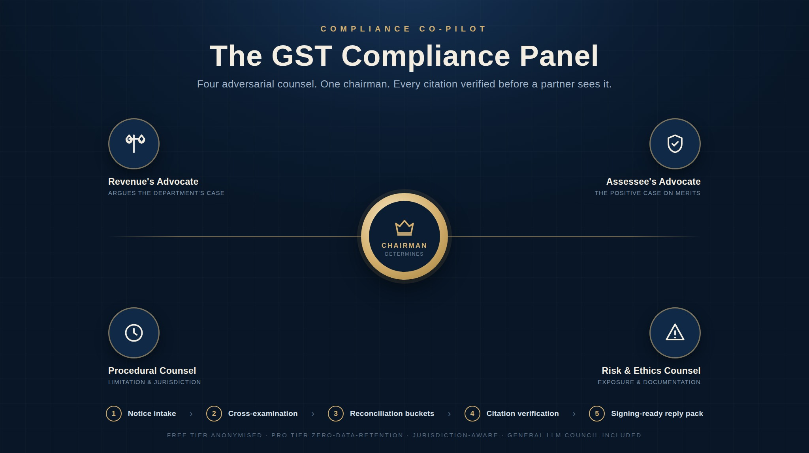

# Compliance Panel — GST advisory, plus the general LLM Council



Two modes in one application:

**Compliance Panel** — an adversarial panel for Indian GST notice work. Four
counsel argue the matter, cross-examine each other, and a chairman determines
the firm's position. Every authority cited is then checked against live
sources and labelled VERIFIED / UNVERIFIED / NOT FOUND before a partner ever
sees it. Output is a reply pack: draft reply, issue-wise analysis, authorities
table, risk flags, board summary, and a working note for the file.

**General Council** — the original multi-model council, for open research
questions rather than a specific notice.

## The Compliance Panel

### Why the counsel are organised this way

A notice usually concerns one law, so a panel of "GST specialist / income tax
specialist / FEMA specialist" produces one real opinion and three empty ones.
This panel is organised by **role in the argument**, which is how a technical
clearance actually runs in a professional firm:

| Counsel | Brief |
|---|---|
| **Revenue's Advocate** | Argues the department's case at its highest, so weaknesses surface internally rather than across the table |
| **Assessee's Advocate** | The positive case on merits, grading each argument STRONG / DEFENSIBLE / WEAK |
| **Procedural Counsel** | Limitation, jurisdiction, natural justice, defects in the notice — where matters are more often won |
| **Risk & Ethics Counsel** | Penalty exposure, aggressiveness of the position, cross-State consistency, amnesty arithmetic, file documentation |
| **Chairman** | Decides. Resolves the disagreements explicitly rather than averaging them |

Stage 2 is **cross-examination**, not ranking: each counsel attacks the others'
reasoning, flags citations it doubts, and concedes where it has been beaten.

### Jurisdiction awareness

A Karnataka High Court ruling binds a Karnataka officer; a contrary Madras
ruling does not. The intake captures the State, and the prompts weight binding
against persuasive precedent accordingly — which is exactly what a group
operating across several registrations needs, and what generic tools ignore.

### Citation verification

The most dangerous failure mode is a fabricated authority reaching a signing
partner. Every citation — from the authorities table *and* from the body of
the draft reply — is extracted and checked. Nothing is ever silently upgraded:
if the checker fails, returns nonsense, or the panel itself flagged a citation
as uncertain, the result is UNVERIFIED.

### Two tiers — a risk tier, not just a price tier

| | Free Council | Pro Council |
|---|---|---|
| Models | DeepSeek R1, GLM, Qwen, Kimi (free endpoints) | GPT-5.5, Claude Opus 4.8, Gemini 3.1 Pro, Grok 4.3 |
| Client identifiers | **Stripped before any request leaves the machine** | Full facts, zero-data-retention routing |
| Output | Research grade, watermarked, export blocked | Signing-ready pack with DOCX export |

Free endpoints are frequently free because the provider may retain or train on
prompts. Sending a client's PAN, GSTIN and dispute particulars there is a
confidentiality breach, so on the free tier anonymisation is enforced in code
and the run aborts if any identifier survives. Identifiers are restored
locally, so the partner still reads real names while the model never saw them.

### Users and roles

| Role | Sees |
|---|---|
| **Partner** | Everything, plus administration and user management |
| **Manager** | Full deliberation and export |
| **Staff** | Determination and verification trail only — not the counsel arguments |

On first run the server creates a partner account and prints the credentials
to its console.

### Nothing is "submittable"

Every export carries: *AI-assisted draft, to be reviewed and signed by a member
of the ICAI; authorities marked UNVERIFIED or NOT FOUND must be independently
confirmed.* The panel replaces the consultants who prepare a position. It does
not replace the professional who signs it.

Instead of asking a question to a single LLM provider, group the frontier models into your "LLM Council". This web app looks like ChatGPT except it uses OpenRouter to send your query to multiple LLMs, asks them to review and rank each other's work (anonymized, and never their own), and finally a Chairman LLM produces the final response.

What happens when you submit a query:

1. **Stage 1: First opinions**. The query — along with the conversation history — is given to all council LLMs individually, and the responses are collected and shown in a tab view. Optionally, models can ground their answers with live **web search**.
2. **Stage 2: Peer review**. Each LLM is given the *other* models' responses, anonymized as "Response A/B/C" so it can't play favorites — and it never sees its own response, so it can't vote for itself. Each reviewer evaluates accuracy, depth, and usefulness, and produces a ranking. Rankings are aggregated with position normalization.
3. **Stage 3: Final response**. The Chairman receives all responses, all reviews, the label→model mapping, and the peer-review consensus, and synthesizes the final answer.

A per-message **Quick mode** skips Stage 2 for faster, cheaper answers (individual responses + synthesis only). Every exchange reports its **token usage and dollar cost**.

## Features

- Multi-turn conversations — the whole council sees the conversation history
- Self-vote-free anonymized peer review with normalized aggregate rankings
- Reasoning effort control (`REASONING_EFFORT=low|medium|high|none`)
- Optional web search grounding per message (OpenRouter web plugin)
- Full vs Quick deliberation modes per message
- Per-message cost and token accounting
- Retries with exponential backoff; per-model failures are surfaced in the UI instead of silently dropped
- Bearer-token auth for private cloud deployment; single-container packaging
- Atomic conversation storage; conversations are deletable from the sidebar

## Setup (local development)

The project uses [uv](https://docs.astral.sh/uv/) for Python and npm for the frontend.

```bash
uv sync
cd frontend && npm install && cd ..
```

Create a `.env` file in the project root (see `.env.example`):

```bash
OPENROUTER_API_KEY=sk-or-v1-...
```

Get your API key at [openrouter.ai](https://openrouter.ai/) and make sure it has credits.

Run it:

```bash
./start.sh
# or manually:
# Terminal 1: uv run python -m backend.main       (API on :8001)
# Terminal 2: cd frontend && npm run dev           (UI on :5173)
```

Open http://localhost:5173. With no `APP_ACCESS_TOKEN` set, auth is disabled locally.

## Configuration

Everything is configurable via environment variables (or `.env`) — no code edits needed:

| Variable | Default | Purpose |
|---|---|---|
| `OPENROUTER_API_KEY` | — | Required |
| `COUNCIL_MODELS` | `openai/gpt-5.5,google/gemini-3.1-pro-preview,anthropic/claude-opus-4.8,x-ai/grok-4.3` | Comma-separated council roster |
| `CHAIRMAN_MODEL` | `google/gemini-3.1-pro-preview` | Synthesizes the final answer |
| `REASONING_EFFORT` | `medium` | `low`/`medium`/`high`/`none` |
| `REQUEST_TIMEOUT` | `180` | Seconds per model call |
| `MAX_RETRIES` | `2` | Retries on transient failures |
| `HISTORY_MAX_TURNS` | `6` | Prior exchanges sent as context |
| `APP_ACCESS_TOKEN` | *(unset = auth off)* | Shared secret for the login screen |
| `DATA_DIR` | `data/conversations` | Conversation storage path |

Configured model IDs are validated against OpenRouter's catalog at startup; check the logs or `GET /api/health` for warnings about stale IDs.

## Running with Docker

```bash
cp .env.example .env   # fill in OPENROUTER_API_KEY (and APP_ACCESS_TOKEN if exposed)
docker compose up --build
```

Open http://localhost:8001 — the container serves both API and UI, and conversation data persists in a named volume.

## Deploying to Render (private cloud)

The repo includes `render.yaml`:

1. Push this repository to your GitHub account.
2. In the [Render dashboard](https://dashboard.render.com/): **New → Blueprint**, select the repo. Render reads `render.yaml` and provisions a Docker web service with a 1 GB persistent disk mounted at `/app/data`.
3. Set `OPENROUTER_API_KEY` when prompted (it's marked `sync: false` so it never lives in the repo).
4. `APP_ACCESS_TOKEN` is auto-generated by Render — copy it from the service's Environment tab. This is the token you'll enter on the login screen.
5. Deploy. Your council is at `https://<service-name>.onrender.com`, protected by the access token, with HTTPS handled by Render.

Any other Docker host (Fly.io, Railway, a VPS) works the same way: build the image, mount a volume at `/app/data`, and set the two secrets.

**Do not deploy publicly without `APP_ACCESS_TOKEN` set** — otherwise anyone who finds the URL can spend your OpenRouter credits and read your conversations.

## Tests

```bash
uv run pytest
```

94 tests covering the sanitizer (identifier leaks — the most important suite in
the repository), citation verification and its never-upgrade rule, panel
orchestration, role prompts, jurisdiction mapping, role permissions, the
ranking parser, and storage.

## Adding the Income Tax pack

The panel engine is domain-agnostic: the four counsel are identical across
laws, and only the injected knowledge differs. A second law is a new file in
`backend/domains/` exposing the same interface as `gst.py` (notice types,
statutory anchors, procedural grounds, State→High Court map, citation
patterns, intake schema), registered in `backend/domains/__init__.py`. No
change to `panel.py`, `roles.py`, `verification.py` or the UI is required.

## Tech Stack

- **Backend:** FastAPI (Python 3.10+), async httpx, OpenRouter API
- **Frontend:** React + Vite, react-markdown for rendering
- **Storage:** JSON files in `data/conversations/` (atomic writes)
- **Packaging:** uv for Python, npm for JavaScript, multi-stage Dockerfile
